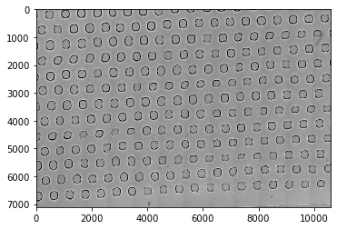
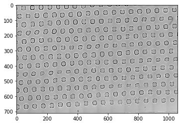
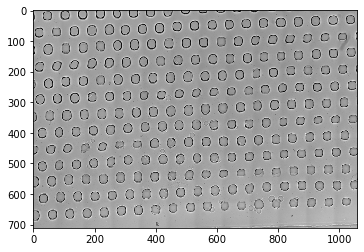

# Image analysis toolbox in Python

## Installation for development

Make sure you use Python 3.8 `python -V`

Otherwise:

```
conda create -n ia python=3.8
conda activate ia
```

or download and install Python 3.8

Install the package in development mode.
```
git clone git@gitlab.pasteur.fr:pub/image-analysis.git
cd image-analysis
pip install -e .
pip install -r requirements.txt
```

## How to contribute

Commit your changes into separate branch with clear name of what's intended to be done.

Write clean code. Supply functions with types, default arguments and doc strings.

Every function should have  unit tests.

Update documentation with new fuctionality.

Once your code meets the goal and all test are passing, make a pull request.

## How to test

Test in virtual environment allows to check if all dependencies included in setup.py

```
pip install tox

tox
```

To see coverage report, run
```
pytest --cov api
```

## API

### processing many 2d tiffs in one folder

```python
from api.core import Well
from api import read

%load_ext autoreload
%autoreload 2
```


```python
prefix = r'Z:/Andrey/data/Salome/20200228/NIS_export/'

```


```python
vs = read.VirtualStack(folder=prefix, search_names='*.tif', regex=r'([ctmz])(\d{1,2})')
```


```python
vs
```


    Virtial Stack instance. 
    Found 864 files in Z:/Andrey/data/Salome/20200228/NIS_export/. Ranges: {'t': {'min': 2, 'max': 33}, 'z': {'min': 1, 'max': 9}, 'c': {'min': 1, 'max': 3}}


```python
vs.ranges
```


    {'t': {'min': 2, 'max': 33},
     'z': {'min': 1, 'max': 9},
     'c': {'min': 1, 'max': 3}}


```python
vs.order
```


    'tzc'


```python
img = vs.get_single_image(t=2,z=1,c=3)
```


```python
img
```


    array (7103, 10599), {'t': 2, 'z': 1, 'c': 3, 'path': 't02z1c3.tif', 'prefix': 'Z:/Andrey/data/Salome/20200228/NIS_export/'}





```python
img.bin(10)
```


    array (711, 1060), {'binning': 10, 't': 2, 'z': 1, 'c': 3, 'path': 't02z1c3.tif', 'prefix': 'Z:/Andrey/data/Salome/20200228/NIS_export/'}





```python
arr = []
for v in vs.read(c=3, z=5, t=None):
    print(v.array.shape, v.array.mean(), v.meta)
    arr.append(v.bin(10))
```

    (7103, 10599) 22025.125744837627 {'c': 3, 'z': 5, 't': 2, 'path': 't02z5c3.tif', 'prefix': 'Z:/Andrey/data/Salome/20200228/NIS_export/'}
    (7103, 10599) 18681.70193876187 {'c': 3, 'z': 5, 't': 3, 'path': 't03z5c3.tif', 'prefix': 'Z:/Andrey/data/Salome/20200228/NIS_export/'}
    (7103, 10599) 16722.82384250016 {'c': 3, 'z': 5, 't': 4, 'path': 't04z5c3.tif', 'prefix': 'Z:/Andrey/data/Salome/20200228/NIS_export/'}
    (7103, 10599) 15384.410027963584 {'c': 3, 'z': 5, 't': 5, 'path': 't05z5c3.tif', 'prefix': 'Z:/Andrey/data/Salome/20200228/NIS_export/'}
    (7103, 10599) 14408.28451075522 {'c': 3, 'z': 5, 't': 6, 'path': 't06z5c3.tif', 'prefix': 'Z:/Andrey/data/Salome/20200228/NIS_export/'}
    (7103, 10599) 13717.93208480337 {'c': 3, 'z': 5, 't': 7, 'path': 't07z5c3.tif', 'prefix': 'Z:/Andrey/data/Salome/20200228/NIS_export/'}
    (7103, 10599) 13176.419330425146 {'c': 3, 'z': 5, 't': 8, 'path': 't08z5c3.tif', 'prefix': 'Z:/Andrey/data/Salome/20200228/NIS_export/'}
    (7103, 10599) 12782.799382735113 {'c': 3, 'z': 5, 't': 9, 'path': 't09z5c3.tif', 'prefix': 'Z:/Andrey/data/Salome/20200228/NIS_export/'}
    (7103, 10599) 12489.992577375984 {'c': 3, 'z': 5, 't': 10, 'path': 't10z5c3.tif', 'prefix': 'Z:/Andrey/data/Salome/20200228/NIS_export/'}
    (7103, 10599) 12283.594468753723 {'c': 3, 'z': 5, 't': 11, 'path': 't11z5c3.tif', 'prefix': 'Z:/Andrey/data/Salome/20200228/NIS_export/'}
    (7103, 10599) 12065.06444705489 {'c': 3, 'z': 5, 't': 12, 'path': 't12z5c3.tif', 'prefix': 'Z:/Andrey/data/Salome/20200228/NIS_export/'}
    (7103, 10599) 11939.86248913242 {'c': 3, 'z': 5, 't': 13, 'path': 't13z5c3.tif', 'prefix': 'Z:/Andrey/data/Salome/20200228/NIS_export/'}
    (7103, 10599) 11808.877272933702 {'c': 3, 'z': 5, 't': 14, 'path': 't14z5c3.tif', 'prefix': 'Z:/Andrey/data/Salome/20200228/NIS_export/'}
    (7103, 10599) 11652.774106203815 {'c': 3, 'z': 5, 't': 15, 'path': 't15z5c3.tif', 'prefix': 'Z:/Andrey/data/Salome/20200228/NIS_export/'}
    (7103, 10599) 11497.962345734088 {'c': 3, 'z': 5, 't': 16, 'path': 't16z5c3.tif', 'prefix': 'Z:/Andrey/data/Salome/20200228/NIS_export/'}
    (7103, 10599) 11473.406400838672 {'c': 3, 'z': 5, 't': 17, 'path': 't17z5c3.tif', 'prefix': 'Z:/Andrey/data/Salome/20200228/NIS_export/'}
    (7103, 10599) 11457.549879545906 {'c': 3, 'z': 5, 't': 18, 'path': 't18z5c3.tif', 'prefix': 'Z:/Andrey/data/Salome/20200228/NIS_export/'}
    (7103, 10599) 11334.965850350703 {'c': 3, 'z': 5, 't': 19, 'path': 't19z5c3.tif', 'prefix': 'Z:/Andrey/data/Salome/20200228/NIS_export/'}
    (7103, 10599) 11226.0378537354 {'c': 3, 'z': 5, 't': 20, 'path': 't20z5c3.tif', 'prefix': 'Z:/Andrey/data/Salome/20200228/NIS_export/'}
    (7103, 10599) 11096.47943686351 {'c': 3, 'z': 5, 't': 21, 'path': 't21z5c3.tif', 'prefix': 'Z:/Andrey/data/Salome/20200228/NIS_export/'}
    (7103, 10599) 11097.373832958378 {'c': 3, 'z': 5, 't': 22, 'path': 't22z5c3.tif', 'prefix': 'Z:/Andrey/data/Salome/20200228/NIS_export/'}
    (7103, 10599) 11008.446842669766 {'c': 3, 'z': 5, 't': 23, 'path': 't23z5c3.tif', 'prefix': 'Z:/Andrey/data/Salome/20200228/NIS_export/'}
    (7103, 10599) 10958.95723028546 {'c': 3, 'z': 5, 't': 24, 'path': 't24z5c3.tif', 'prefix': 'Z:/Andrey/data/Salome/20200228/NIS_export/'}
    (7103, 10599) 10921.33980318736 {'c': 3, 'z': 5, 't': 25, 'path': 't25z5c3.tif', 'prefix': 'Z:/Andrey/data/Salome/20200228/NIS_export/'}
    (7103, 10599) 10955.710640251365 {'c': 3, 'z': 5, 't': 26, 'path': 't26z5c3.tif', 'prefix': 'Z:/Andrey/data/Salome/20200228/NIS_export/'}
    (7103, 10599) 11009.535321833067 {'c': 3, 'z': 5, 't': 27, 'path': 't27z5c3.tif', 'prefix': 'Z:/Andrey/data/Salome/20200228/NIS_export/'}
    (7103, 10599) 10954.281469340309 {'c': 3, 'z': 5, 't': 28, 'path': 't28z5c3.tif', 'prefix': 'Z:/Andrey/data/Salome/20200228/NIS_export/'}
    (7103, 10599) 10883.277468978855 {'c': 3, 'z': 5, 't': 29, 'path': 't29z5c3.tif', 'prefix': 'Z:/Andrey/data/Salome/20200228/NIS_export/'}
    (7103, 10599) 10838.614174259079 {'c': 3, 'z': 5, 't': 30, 'path': 't30z5c3.tif', 'prefix': 'Z:/Andrey/data/Salome/20200228/NIS_export/'}
    (7103, 10599) 10676.980981367302 {'c': 3, 'z': 5, 't': 31, 'path': 't31z5c3.tif', 'prefix': 'Z:/Andrey/data/Salome/20200228/NIS_export/'}
    (7103, 10599) 10527.156655528546 {'c': 3, 'z': 5, 't': 32, 'path': 't32z5c3.tif', 'prefix': 'Z:/Andrey/data/Salome/20200228/NIS_export/'}
    (7103, 10599) 10447.355351606184 {'c': 3, 'z': 5, 't': 33, 'path': 't33z5c3.tif', 'prefix': 'Z:/Andrey/data/Salome/20200228/NIS_export/'}
    


```python
w = Well.stack(arr)
```


```python
w
```

    Showing first layer
    array (32, 711, 1060), {'binning': {10}, 'c': {3}, 'z': {5}, 't': {2, 3, 4, 5, 6, 7, 8, 9, 10, 11, 12, 13, 14, 15, 16, 17, 18, 19, 20, 21, 22, 23, 24, 25, 26, 27, 28, 29, 30, 31, 32, 33}, 'path': {'t14z5c3.tif', 't30z5c3.tif', 't18z5c3.tif', 't13z5c3.tif', 't02z5c3.tif', 't19z5c3.tif', 't29z5c3.tif', 't25z5c3.tif', 't33z5c3.tif', 't03z5c3.tif', 't32z5c3.tif', 't10z5c3.tif', 't31z5c3.tif', 't15z5c3.tif', 't27z5c3.tif', 't11z5c3.tif', 't17z5c3.tif', 't20z5c3.tif', 't06z5c3.tif', 't16z5c3.tif', 't05z5c3.tif', 't12z5c3.tif', 't04z5c3.tif', 't23z5c3.tif', 't24z5c3.tif', 't08z5c3.tif', 't22z5c3.tif', 't26z5c3.tif', 't07z5c3.tif', 't28z5c3.tif', 't21z5c3.tif', 't09z5c3.tif'}, 'prefix': {'Z:/Andrey/data/Salome/20200228/NIS_export/'}, 'stacked': 32}


## Read nd2 file

```python
        Example:
        --------
        >>> from api.read import nd2_stack
        >>> r = nd2_stack.ND2Reader('D2001.nd2')
        >>> r
            nd2 dataset from `D2001.nd2`,
                ranges: {'x': 2048, 'y': 2044, 'c': 2, 'm': 12},
                channels: ['FITC', 'DaFiTr']
                pixel size: 0.325 um
        >>> r.channels
            ['FITC', 'DaFiTr']
        >>> single_image = r.get_single_image(c=0, m=0)
        >>> single_image
            array (2044, 2048), {'x_um': -26555.7, 'y_um': -2942.4, 'z_um': 3691.9, 
            't_ms': 1446.9611667967401, 'colors': [(0.0, 1.0, 0.0), (1.0, 1.0, 1.0)], 
            'mpp': 0.325, 'max_value': 65535, 'x': 0, 'y': 0, 'c': 0, 'm': 0, 
            'axes': ['y', 'x'], 'coords': {'m': 0, 'c': 0}}
        >>> single_image.array
            array([[173, 155, 183, ..., 126, 131, 125],
                [174, 153, 163, ..., 112, 129, 126],
                [168, 179, 169, ..., 125, 135, 119],
                ...,
                [135, 136, 134, ..., 142, 122, 123],
                [130, 135, 128, ..., 129, 129, 119],
                [144, 131, 131, ..., 124, 116, 127]], dtype=uint16)
        >>> mm = r.read(bin=10, c=1)
        >>> for m in mm:
        >>>     print(m.shape,m.meta['m'], m.meta['c'])
            (205, 205) 0 1
            (205, 205) 1 1
            (205, 205) 2 1
            (205, 205) 3 1
            (205, 205) 4 1
            (205, 205) 5 1
            (205, 205) 6 1
            (205, 205) 7 1
            (205, 205) 8 1
            (205, 205) 9 1
            (205, 205) 10 1
            (205, 205) 11 1
        >>> m
            array (205, 205),
            {'binning': 10, 'x_um': -15416.2, 'y_um': 5327.700000000001, 
            'z_um': 3691.9, 't_ms': 23359.35130351549,
            'colors': [(0.0, 1.0, 0.0), (1.0, 1.0, 1.0)],
            'mpp': 0.325, 'max_value': 65535,
            'x': 0, 'y': 0, 'c': 1, 'm': 11,
            'axes': ['y', 'x'], 'coords': {'m': 11, 'c': 1},
            'channel': 'DaFiTr'}
        >>> m.array
            array([[1166.67, 1155.1 , 1165.44, ..., 1251.21, 1223.05,  952.66],
                [1158.88, 1167.49, 1166.63, ..., 1201.28, 1185.37,  927.92],
                [1158.49, 1161.95, 1167.47, ..., 1158.68, 1155.93,  947.83],
                ...,
                [1052.04, 1092.88, 1316.46, ..., 1237.19, 1245.07,  977.19],
                [1126.38, 1124.62, 1259.61, ..., 1231.87, 1254.46,  992.66],
                [ 467.3 ,  528.08,  474.7 , ...,  502.25,  515.58,  394.93]])
    ```


## Segmenting a spheroid

### a) from a single well

Where each .tiff file has a single well to crop. Then:

```python

muTopx = 3
wellSize = 410
cropSize = 410

from api import segment

vs = read.VirtualStack(folder=prefix, search_names='*.tif', regex=r'([ctmz])(\d{1,2})')
BF_img = vs.get_single_image(t=2,z=1,c=1)

BF_crop = segment.select_well(im, wellSize, cropSize, muTopx)
BF_sph = segment.find_spheroid(BF_crop, wellSize, muTopx)
```


